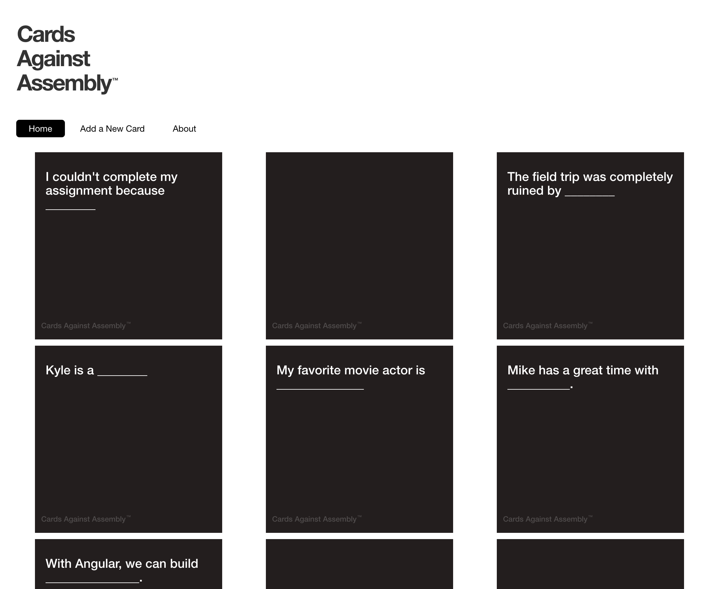

# GA Cards - React 

## Preparation

- [create-react-app](https://github.com/facebookincubator/create-react-app)

## Demo

> [ga-cards.herokuapp.com](https://mdang.github.io/ga-cards-angular4)

Cards are user generated and initially appear face down until a user clicks on the card, which then reveals it.



## Cards API 

- **GET** [https://ga-cards.herokuapp.com/cards](https://ga-cards.herokuapp.com/cards)
	- Note: Older cards don't have a `createdAt` value

```json
[
  {
    "_id": "5631462be4b07f34b0915a0c",
    "question": "I couldn't complete my assignment because ________"
  },
  {
    "_id": "56314647e4b07f34b0915a1c",
    "question": "I get by with a little help from ________"
  },
  {
    "_id": "5631465fe4b07f34b0915a1f",
    "question": "The field trip was completely ruined by ________"
  },
  {
    "_id": "590231880f48d5419f94f4fc",
    "question": "It was the best of _________, it was the worst of ________.",
    "createdAt": "2017-04-27T17:59:36.595Z",
    "__v": 0
  },
  {
    "_id": "590231caab657d0c98036421",
    "question": "I'm very bad at this because _________",
    "createdAt": "2017-04-27T18:00:42.162Z",
    "__v": 0
  }
]
```

- **POST** [https://ga-cards.herokuapp.com/cards](https://ga-cards.herokuapp.com/cards)
	- Parameter: `question` - **required** - Question to add

## Starter Code

Look into the [mockup folder](./mockup) for the HTML and CSS required for the application. 

## Set up Components

Create the components you'll need and place the CSS in the relevant component CSS files. 

- `Header`
- `Footer`
- `Nav`
- `Cards`
- `Card`
- `AddCard`
- `About`

## Set up Router

```
$ npm i react-router-dom --save
```

```js
// App.js
import {
	BrowserRouter as Router,
	Route
} from 'react-router-dom';
```

Fix the nav active class

```js
<NavLink activeClassName="active" exact to="/">Home</NavLink>
<NavLink activeClassName="active" to="/add">Add a Card</NavLink>
<NavLink activeClassName="active" to="/about">About</NavLink>
```


## Set up the Card Component to Use Props

```js
// Card.js
class Card extends Component {
  render() {
    return (
      <div className="col-sm-6 col-md-3 col-lg-3">
        <div className="card">
          <h4 className="card-title">{ this.props.question }</h4>
          <h6>Cards Against Assembly</h6>
        </div>
      </div>
    )
  }
}
```

## Set up Cards Component to Access the API 

- Access the GET API at [https://ga-cards.herokuapp.com/cards](https://ga-cards.herokuapp.com/cards)
- Have the `Cards` component output the results using `Card`
- Assign a key

## Set up `dotenv`

```
$ touch .env.local
$ touch .env.production.local
```

## Set up Add Card 

- Set up state in `Card`
- Have both the form field and preview bound to the same state for live preview 
- Add event handler to add question to the API 

## Hide Cards Until Clicked

 
